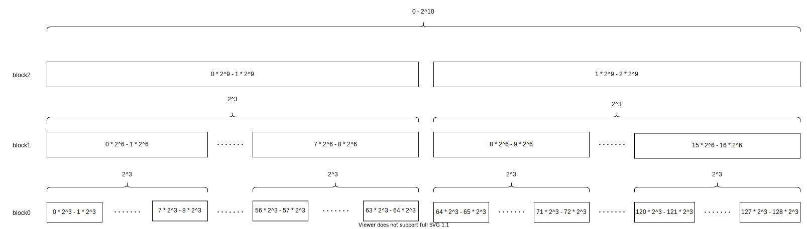

# Range Query
To query the sum of a range.

The idea is to recursively divide the range into smaller ranges, and 
we store the sum of these ranges. When update/insert/cancel a value, we
need to update its corresponding range in each layer exactly once. When query
a range, we select the possible biggest precomuted range to sum. In this way,
in each layer, we only need no more than constant operations. At last, we don't
store the single value to save memory. 
Instead, when we need to get a value of single element,
we use a callback that uses sets.

The below graph shows that when all value are between 0 and 2^10, the hierarchy of
ranges we construct. To compute efficiently and convinently, we choose base 2.



Note: 
- It only supports `int` value. If you need `float` value, consider converting it
into integer.
- You could rewrite the program using your favorite language without little effort.

## API (Header Only; C++11)
```cpp
template <typename ValueType>
class RangeQuery {
public:
    /**
     * @N the biggest possible value is 2^N.
     * @E the number of sub-blocks is 2^E.
     */
    RangeQuery(int N, int E, std::function<ValueType(int)> func);

    /**
     * @return if successfully update.
     */ 
    bool update(int x, ValueType diff);

    /**
     * @l the left of the queried range (included)
     * @r the right of the queired range (excluded)
     */ 
    ValueType query(int l, int r) const;
}
```

## Example
```cpp
std::unordered_map<int, double> values{
        {32, 40.2},
        {27, 24.4},
        {100, 1.1}
};

// Construct a RangeQuery object.
RangeQuery<double> rangeQuery(10, 3, [&](int x) -> double {
    if (values.find(x) != values.end()) return values[x];
    return 0;
});


// Need to update RangeQuery with the existed value.
for (auto it = values.begin(); it != values.end(); it++) {
    rangeQuery.update(it->first, it->second);
}

rangeQuery.update(800, 800.1);

assert(rangeQuery.query(700, 900) == 800.1);
assert(rangeQuery.query(1, 10) == 0);
assert(rangeQuery.query(1, 32) == 24.4);
assert(rangeQuery.query(1, 33) == 64.6);
assert(rangeQuery.query(100, 101) == 1.1);
assert(rangeQuery.query(1, 1000) == 865.8);

rangeQuery.update(800, -200);
assert(rangeQuery.query(10, 1024) == 665.8);

```
